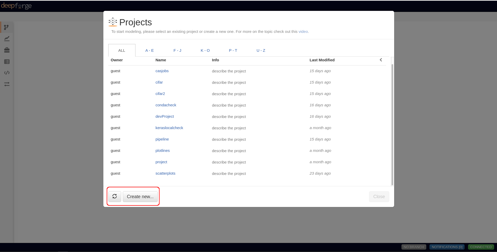
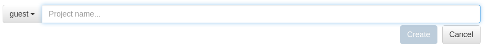
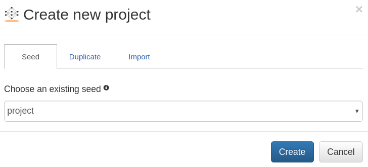
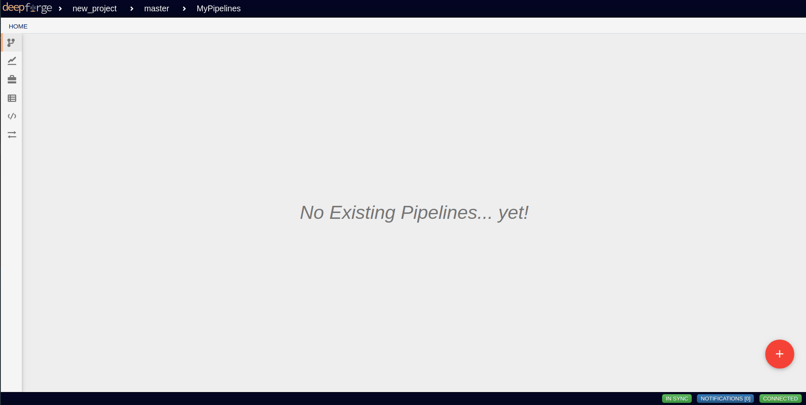
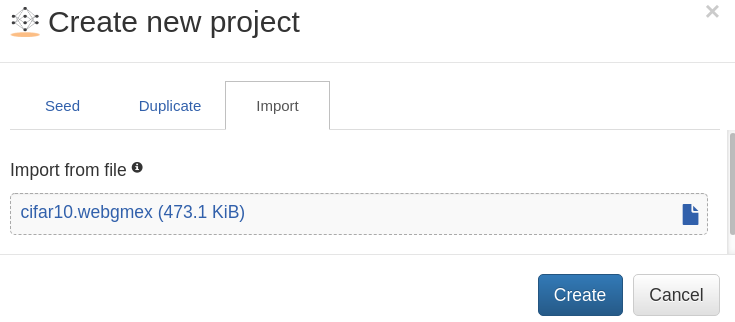
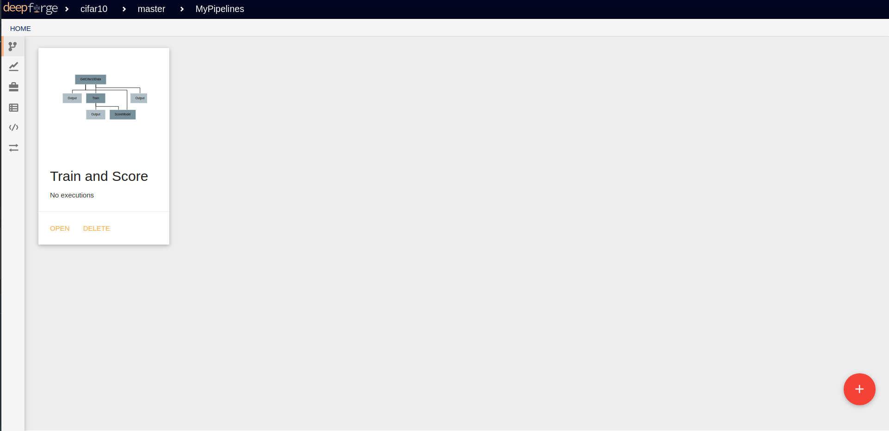
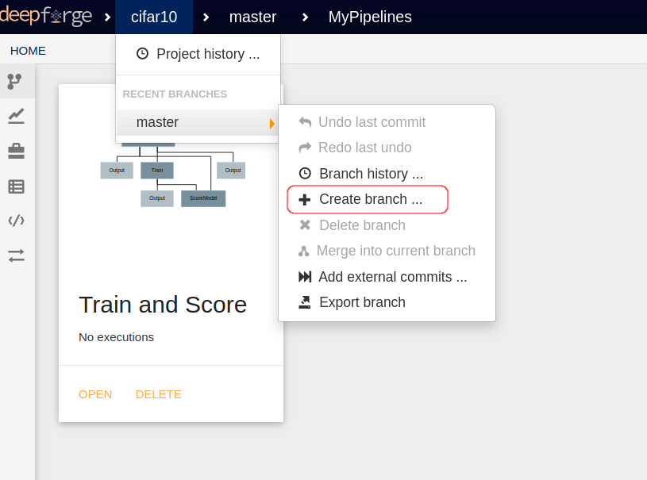
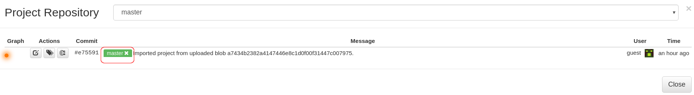

Managing Projects
=================

.. _WebGME: https://webgme.org
.. _DeepForge Examples: https://github.com/deepforge-dev/examples/tree/master/cifar10

In this tutorial, we will look into creating, importing  and exporting `DeepForge` projects. Built on top of WebGME_, `DeepForge` projects natively support version control, branching and collaborative editing.

Creating a new Project
----------------------

In order to create a new project, open `DeepForge` webpage on your browser as shown below (Here, we open a local deployment of `DeepForge` at http://localhost:8888 ):

    DeepForge Start Page

As shown in the figure above, the interface loads the existing projects in the deployment from there you can either navigate to an existing project or create a new one. To create a project, click on `Create new...` button highlighted in the figure above and provide a name for your project.

    Project Name

After you provide a valid name for your project, you have three options:

1. You can choose a project seed (Default)
2. You can duplicate an existing project
3. You can import a project from local file system

For an empty new project, select default project seed and click on `Create` button as shown in the figure below:

    Empty New Project

Upon success, you will be redirected to the pipelines tab and you can start creating your `pipelines`.

    New Project Page

Alternatively, you can also click the `DeepForge` icon on the top left corner and click on `+ New Project` option  to create a new project.

.. figure:: alternate_project_creation.png
    :align: center

    Icon Menu

.. _Importing an Existing Project:

Importing an Existing Project
------------------------------
You can also import an existing project into `DeepForge`. Let's import a CIFAR-10 classification project in `DeepForge Examples`_. In order to import the project, download `cifar10.webgmex` file from the `DeepForge Examples`_ repo:

.. code-block:: bash

    wget https://github.com/deepforge-dev/examples/raw/master/cifar10/cifar10.webgmex

After downloading the file, follow the steps shown in :ref:`Creating a new Project`, but instead of selecting an empty project seed select the `Import` tab and upload the file `cifar10.webgmex` as shown below:

    Importing an Existing Project

After you click on `Create` the project will be imported and you view the existing `pipelines`, `artifacts` for the project. As shown in the figure below, the example has one pipeline (Train and Score) which is now available for execution/editing.

    cifar10 Project

Making Changes using Branches
-----------------------------
Changes to an existing project can be made effectively using branches. In this section, will will build upon the the import done in :ref:`previous section<Importing an Existing Project>` and add our own changes to the example project. Although, you can edit and make changes to the project in the default branch (`master`), it is recommended to create a new branch make your changes, test them and once ready, merge it back to the default branch. In order to create a new branch click on `Create Branch` option from the project as highlighted below:

    Creating Branch in a DeepForge Project

After you click on Create Branch, The following Modal tab is displayed:

    Branch Options in a DeepForge Project

Click on the highlighted section to create a new branch. After you create a branch, all the changes to the project will be specific to the branch. This will also be helpful while using collaborative editing.

