Managing Data in DeepForge
==========================

In any machine learning/ scientific workflow endeavour, `datasets` play a major role. In DeepForge, the results/inputs of/to an operation can be saved into different storage backends enabled on the deployment.

In this tutorial, we will look into managing artifacts (data) for a DeepForge Operation. Before starting, `create a new empty project <./creating_project.html#creating-a-new-project>`_.

.. note::

    The DeepForge project for this section can be downloaded `here <https://vanderbilt365-my.sharepoint.com/:u:/g/personal/umesh_timalsina_vanderbilt_edu/EalBIZyJabhEhZzjL5Zx-18Ba3B_Zvnkvcc5abm-oZtyxg?e=4L2gli>`_.

Loading a pickled file
----------------------

Let's load in a pickled file and visualize the contents of the file in DeepForge. Use the following ``code`` to generate the pickle  file ``mnist_sample.pkl``.

.. code-block:: python

    import pickle

    import numpy as np
    from keras.datasets import mnist

    np.random.seed(42)

    def sample_cifar(num_samples=25):
        ((train_x, train_y), (_, _)) = mnist.load_data()
        idxes = np.random.randint(train_x.shape[0], size=num_samples)
        dataset = {
            'X': train_x[idxes],
            'y': train_y[idxes]
        }
        with open('mnist_sample.pkl', 'wb') as mnist_pkl:
            pickle.dump(dataset, mnist_pkl)

    if __name__ == '__main__':
        sample_cifar()

In the newly created project navigate to `My Artifacts` and click on `Upload artifact` as highlighted in the figure below:

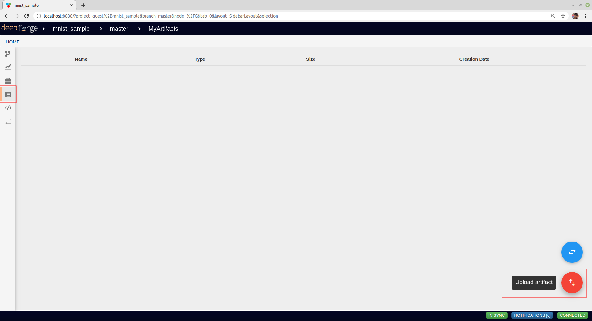

    My Artifacts

After you click on `Upload artifact`, you will be prompted with the following Modal. Click on `Data to upload` to upload the file ``mnist_sample.pkl`` and click on the Run button as highlighted in the figure below (For this example we are using `WebGME Blob Storage` as the storage backend.)

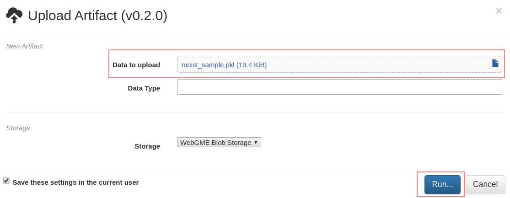

    Uploading Sample Data in DeepForge

Upon success, the artifact(`mnist_sample`) will be displayed in the `My Artifacts` and will be available in your DeepForge pipeline:

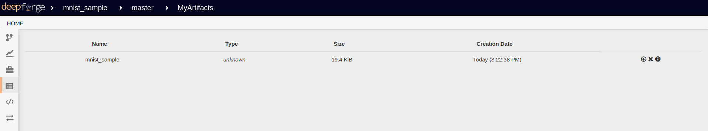

    Artifact Index

Using Imported data
~~~~~~~~~~~~~~~~~~~
Now that `mnist_sample` is available as an artifact, let's write an operation to visualize the images from the sample dataset. Navigate to `My Pipelines` to create a new `Pipeline` called `Visualize MNIST` as shown in the figure below:

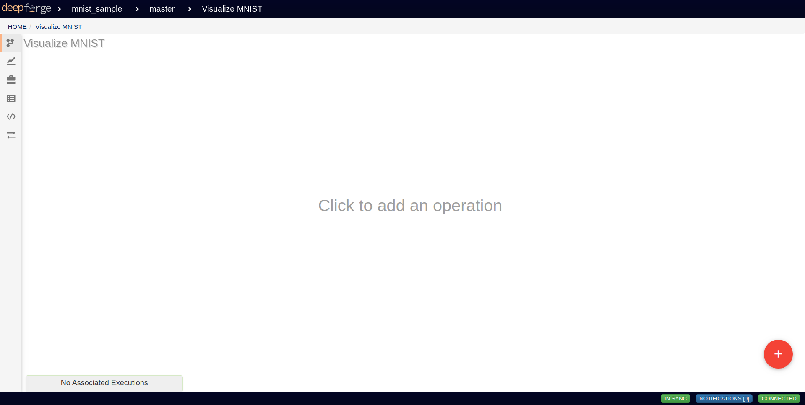

    Pipeline Visualize MNIST

The operation to visualize images called `VisualizeMNISTImages` is shown in the figure below:

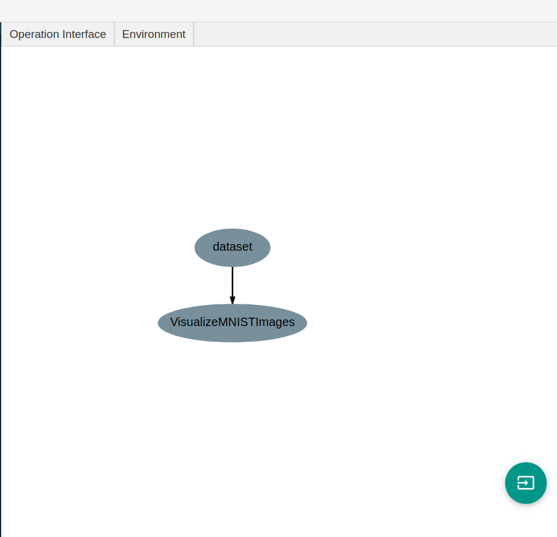

    Operation VisualizeMNISTImages

The code for the operation is shown below:

.. code-block:: python

    # Editing "VisualizeMNISTImages" Implementation
    #
    # The 'execute' method will be called when the operation is run
    from matplotlib import pyplot

    class VisualizeMNISTImages():

        def execute(self, dataset):
            images = dataset['X']
            for i in range(9):
                # define subplot
                pyplot.subplot(330 + 1 + i)
                # plot raw pixel data
                pyplot.imshow(images[i], cmap=pyplot.get_cmap('gray'))
            # show the figure
            pyplot.show()

Any `argument` to the execute method for an operation can use the artifacts available in a DeepForge project. To use the `mnist_sample` for visualizing the images in the pickle file add an `Input` node to the pipeline:

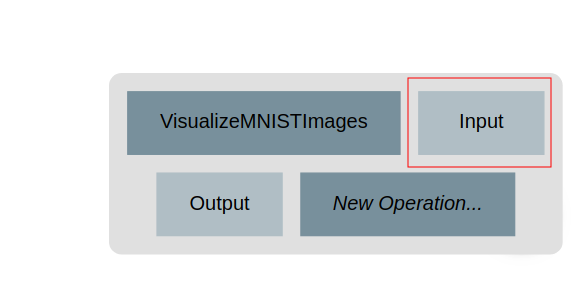

    Input Node

Replace the artifact in the added `Input` node and select `mnist_sample` as shown in the figure below:

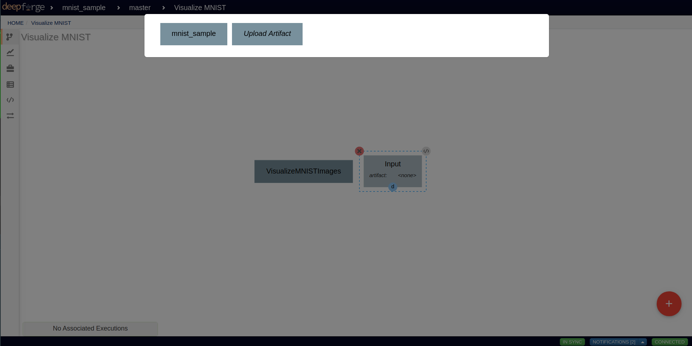

    Using uploaded data in a pipeline

After that, the data will be available to use in the operation, The following figure shows sample execution:

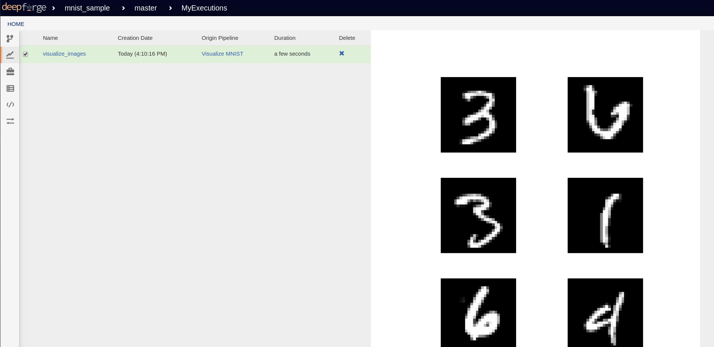

    Visualizing Images

Visualizing a FITS file with custom serialization
-------------------------------------------------

By default, DeepForge uses pickle to serialize `artifacts` and load them on operations. In this example, we will look into how to visualize fits images using a custom serialization in DeepForge. The FITS files we will use are available to download `here <http://www.astropy.org/astropy-data/visualization/reprojected_sdss_r.fits.bz2>`_, `here <http://www.astropy.org/astropy-data/visualization/reprojected_sdss_g.fits.bz2>`_ and `here <http://www.astropy.org/astropy-data/visualization/reprojected_sdss_i.fits.bz2>`_. Before we start uploading the FITS files, we have to write a custom serializer for the FITS file, which can then be utilized for consumption in our operation.

For visualizing FITS files, we will be using the `astropy <https://github.com/astropy/astropy>`_ python library. Function ``astropy.io.fits.open``, is able to handle a raw compressed binary FITS file or a simple filename. To visualize the file in DeepForge you can register a serializer for FITS file by writing a new class for handling them. For that, navigate to `My Utilities` and add a new python module called ``fits_file.py`` as highlighted in the figure below:

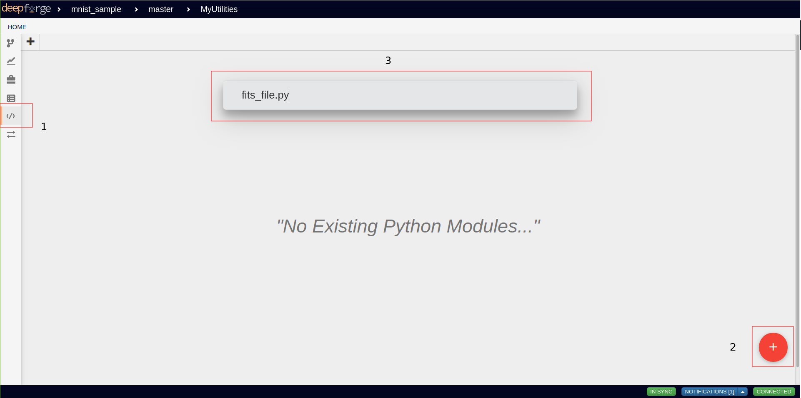

    Custom Utils

After you click on Enter, a text editor will open. Copy and paste the following content:

.. code-block:: python

    from astropy.io import fits

    class FitsFile():

        def __init__(self, file):
            self.name = file.name
            self.file = file

        def load(self):
            return fits.open(self.file)

        def save(self, outfile):
            os.system('ln -s ' + self.name + ' ' + outfile.name)

    def load(infile):
        fits_file = FitsFile(infile)
        return fits_file.load()

    def save(fits_file, out_file):
        fits_file.save(out_file)

Figure below shows the text editor with the content:

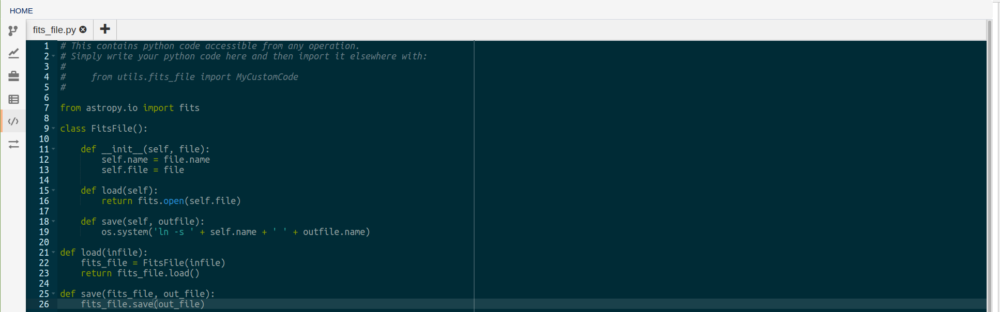

    FITS Serializer

Now, we are ready to import files as described in :ref:`previous section <Loading a pickled file>`, but this time specifying the `Data Type` as ``utils.fits_file.FitsFile``. This is shown in the figure below (For one FITS File):

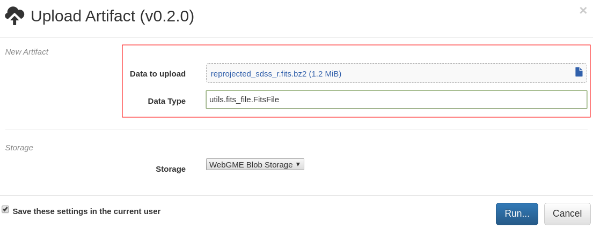

    Uploading Artifact with a Custom Serializer

Now we are ready to use the files. Follow similar steps for all the FITS files you want to use. In our case, we want to visualize them using ``make_lupton_rgb`` function in ``astropy.visualization`` package. The pipeline `Visualize FITS` is shown below:

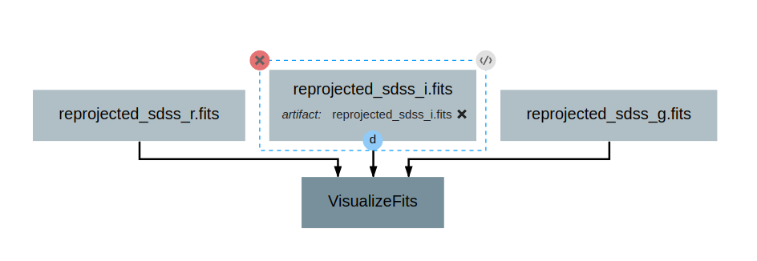

    Pipeline Visualize FITS

The `pipeline` has a single operation called `VisualizeFITS` that uses the FITS file we uploaded with custom serializer.

Using data available different storage backends
-----------------------------------------------
In DeepForge there are several options to upload/import an artifact to/from.

In this example, we will look into importing an existing file in `sciserver-files <https://apps.sciserver.org/dashboard/files/uservolumes>`_ for use in DeepForge. If you have a file called `dataset.npz` in sciserver-files, in a user volume called `Datasets` in the `Storage Volume Pool` and you want to Import it in DeepForge, Select `Import existing data` from the Artifact Index as highlighted below:

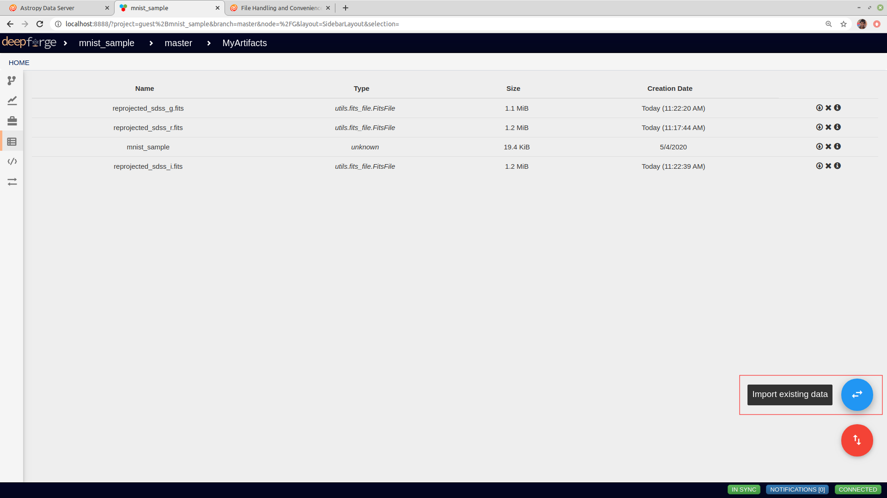

    Importing Existing Data

After you click on Import Existing Data, a Modal as shown below will pop up, select `Sciserver Files Service` from the dropdown menu. Provide your `username` and `password` for SciServer and select correct volume pool and file path as shown in the figure below:

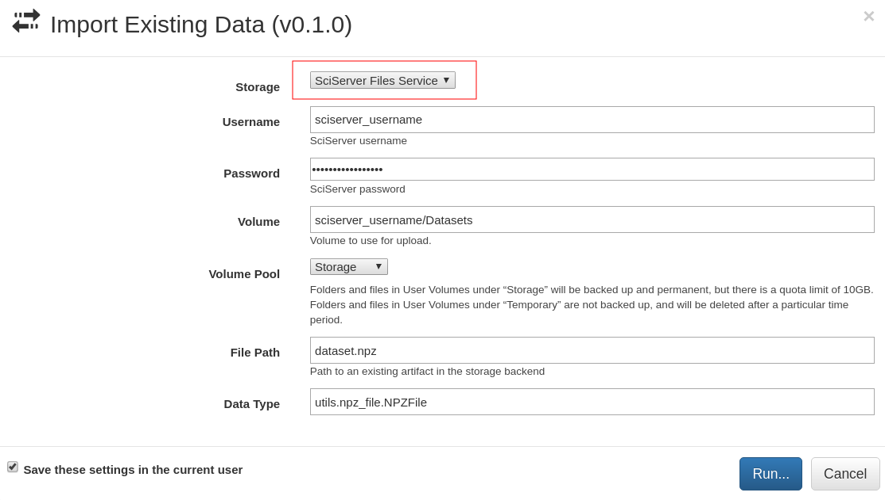

    SciServer File Import

Upon Success, the artifact will be available for use in DeepForge.

.. note::
    See `Storage and Compute Adapters <../fundamentals/integration.html>`_ for more information on storage backends.
